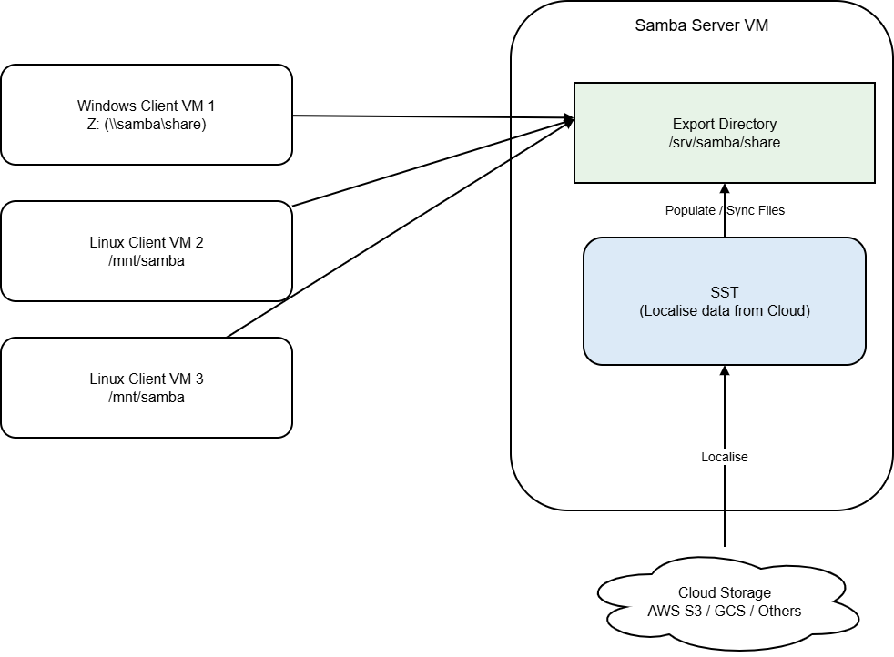

# Setup Samba Server and Clients for SST Localization

## 1. Overview

This document describes how to set up a **Samba-based file sharing environment** for **SST localization**, covering both **server-side** and **client-side** configurations.

The objective of this setup is to provide a **simple, reliable, and cross-platform file sharing solution** that enables:

- A Linux system to serve as a centralized Samba file server
- Windows and Linux clients to access shared SST localization data
- Consistent and synchronized access to shared files across different operating systems

### Architecture Overview

